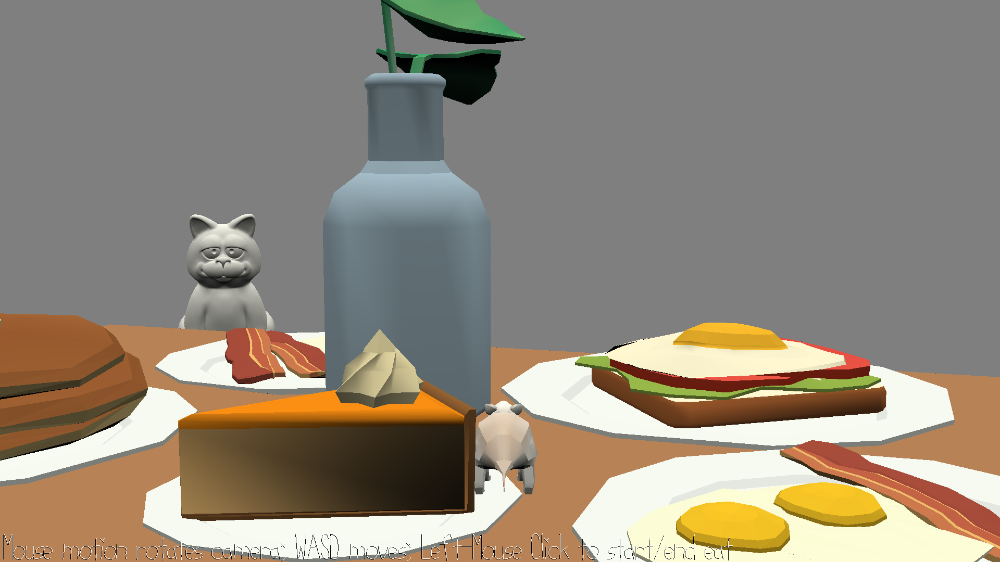

# Hungry Rat

Author: Wenxuan Huang

Design: Move around and try to eat all the food without being detected by the cat. Listen carefully and stay in the shadow.

Screen Shot:

How To Play:

WASD to Move, mouse movement to control the angle, left click to start/end eating.
Stay hidden behind the vase when the cat are looking for you.

Sources: 
	BGM https://freepd.com/music/Foam%20Rubber.mp3
	Cat-Meow https://freesound.org/people/tuberatanka/sounds/110011/download/110011__tuberatanka__cat-meow.wav
	Eat https://freesound.org/people/omgbong/sounds/411597/download/411597__omgbong__eating-an-apple-01.wav
	Rat-Death https://freesound.org/people/toefur/sounds/288941/download/288941__toefur__rat-squeak.wav
	Victory Burp https://freesound.org/people/InspectorJ/sounds/428137/download/428137__inspectorj__burp-male-short-a.wav
	Cat Model https://free3d.com/3d-model/cat-v1--220685.html

This game was built with [NEST](NEST.md).

